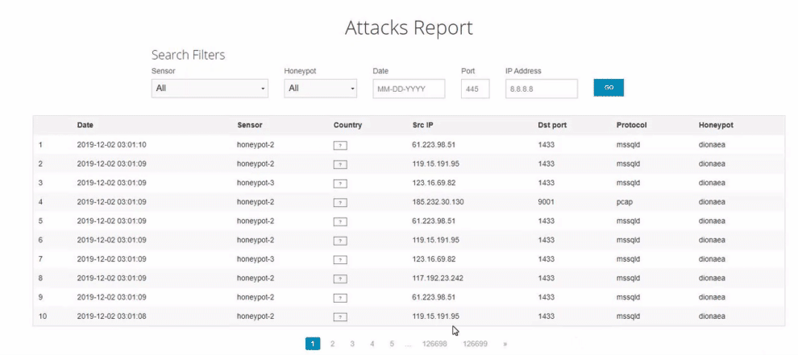

# Honeypot Assignment

**Time spent:** **27** hours spent in total

**Objective:** Create a honeynet using MHN-Admin. Present your findings as if you were requested to give a brief report of the current state of Internet security. Assume that your audience is a current employer who is questioning why the company should allocate anymore resources to the IT security team.

### MHN-Admin Deployment (Required)

**Summary:** Deployment was done by using virtualbox.

### Dionaea Honeypot Deployment (Required)

**Summary:** Dionaea is a honeypot that captures attack payloads and malware.

## Notes

Describe any challenges encountered while doing the assign
